# 2025年你必须了解的22款顶级客户评价收集工具

做生意的都知道,客户说你好,比你自己说一百遍都管用。问题是怎么把客户的好评收集起来,然后大大方方展示在网站上、社交媒体里,让潜在买家看得到、信得过?传统方法太笨了——发邮件追着要,客户懒得回;收到文字评价又不够生动;视频见证拍得好,剪辑又是个大工程。好消息是现在有专门的工具帮你搞定这些麻烦事,从收集到展示一条龙,有些连代码都不用写。

这份清单整理了22个值得关注的客户评价收集平台,涵盖文字评价、视频见证、社交媒体评论导入、网站信任徽章等多种社交证明形式。有些平台专注视频见证的采集和自动剪辑,有些擅长把各个平台的评价汇总到一个仪表板,还有些能实时弹出"刚刚有人下单"的通知增强紧迫感。不管你是SaaS创业者、电商店主、自由职业者还是营销机构,都能找到适合自己业务节奏的解决方案。

***

## **[Testimonial](https://testimonial.to)**

几分钟内收集并嵌入客户评价的一站式平台,无需开发者支持。

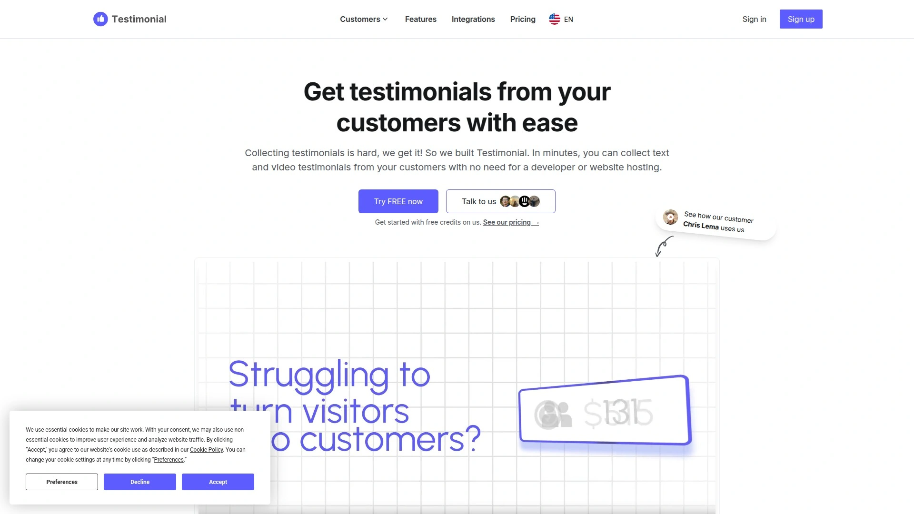

Testimonial最大的优势是简单高效,从零到完成整个评价墙的部署只需要2分钟。创建一个专属落地页,通过邮件、社交媒体甚至短信分享链接,客户点进去就能直接录制视频或输入文字评价。后台有个干净清爽的仪表板管理所有评价,就像邮箱收件箱一样好用。收集到的评价可以一键生成"爱墙"(Wall of Love),用三行HTML代码嵌入任何网站,支持Webflow、WordPress等所有无代码平台。

视频评价自带免广告托管,不需要额外用Wistia或Vimeo这些第三方服务。如果你在Twitter、LinkedIn、YouTube、G2、Google、Capterra、Yelp等平台已经有评价,也能全部导入到Testimonial统一管理。Ultimate方案还提供详细的视频表现追踪指标,帮营销团队快速了解哪些视频效果最好,然后推到不同渠道去用。

整个产品的设计理念就是"让非技术人员也能轻松搞定社交证明"。从财富500强到初创公司、营销机构、房地产经纪人、自由职业者,各种类型的企业都在用。

---

## **[Senja](https://senja.io)**

免费方案就能收集无限评价,自带26个外部导入源和AI分析功能。

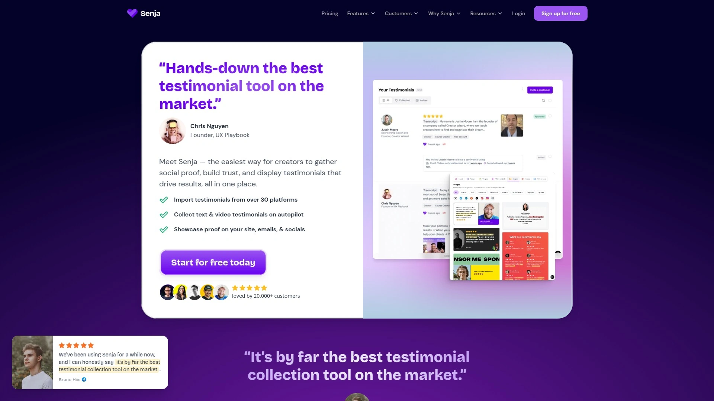

Senja在用户体验和客户支持方面口碑很好,自己都收到了一堆客户见证。它的特别之处在于展示评价的方式特别多样——可以做成弹窗、图片、动画、爱墙、嵌入式小部件,几千种组合任你选。

收集功能很全面,支持文字和视频,付费方案都是无限响应。更厉害的是导入能力,支持26个外部平台,其中11个还能自动同步。也就是说你在Google、Trustpilot、Capterra上新收到的评价会自动出现在Senja里,不用手动倒腾。视频可以导出高清版本,自带视频剪裁功能,虽然高级编辑选项暂时没有,但考虑到价格和其他功能的丰富程度,性价比还是很高的。

平台内置分析功能,能追踪评价的浏览量、互动率、点击率、提交率。AI分析会帮你从评价里挖掘隐藏的洞察,比如客户反复提到的痛点、最受欢迎的功能等。所有这些在免费方案里都能试用,这点很良心。

***

## **[Famewall](https://famewall.io)**

价格最亲民的视频评价工具,免费方案很慷慨,付费后无限收集。

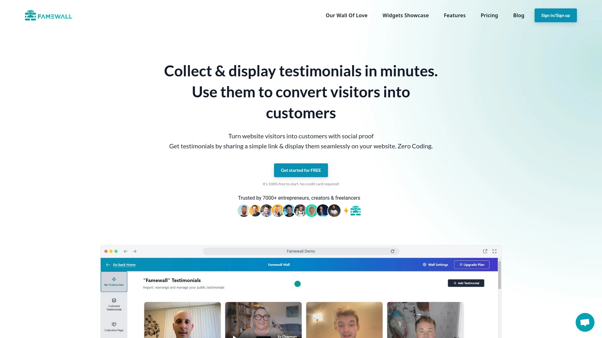

Famewall的创始人自己就说,这个工具的核心竞争力是"既便宜又全面"。免费方案足够大多数人起步用,专业版起就能收集无限数量的视频和文字评价,没有任何限制。很多同类产品要么限制视频数量,要么想要无限收集就得花很多钱,Famewall在这点上很实在。

**收集体验很贴心:**
- 评价收集页面可以放你自己录的欢迎视频,让客户感觉更亲切,提交率能翻倍
- 录制界面功能完善,客户能选择摄像头和麦克风,不满意可以重录,直到满意再提交
- 内置免费的评价问题生成器,帮你设计出更容易获得好评的提问

**展示方式灵活:**
可以把单个视频评价做成独立页面分享在邮件、社交媒体里;也可以用小部件嵌入网站,样式随便选。还有个很酷的功能是把评价自动转成带字幕的音频图视频,直接用在社交媒体广告里。

除了自己收集,还能从Twitter、LinkedIn、Reddit、各大应用商店等25+平台导入已有评价。专业版起就支持自定义域名和团队成员功能。

***

## **[StoryPrompt](https://storyprompt.com)**

视频互动式评价收集工具,你录个问题,客户录个回答,特别适合视频营销。

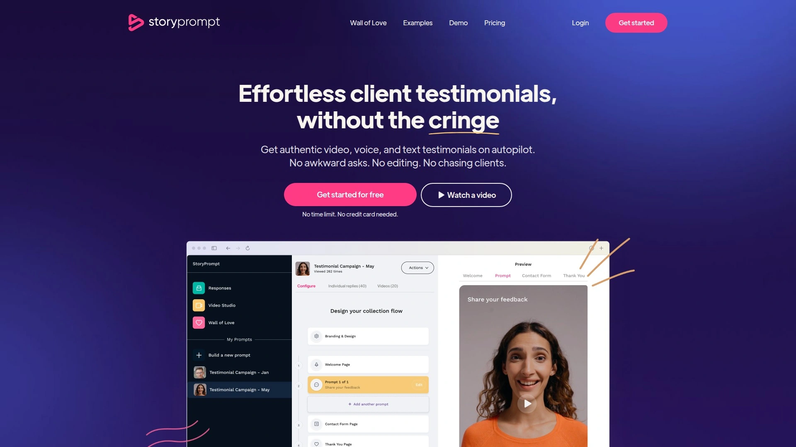

StoryPrompt的逻辑和其他工具不太一样,它不用表单,而是让你先录一段视频提问,然后把链接发给客户,客户看完你的视频后直接录制回复。这种方式很适合做互动式客户访谈或案例研究视频。

平台支持用AI给视频加品牌元素,自动添加你的Logo、背景音乐、B-roll镜头等。所有收到的视频都会附带回复者的联系信息,你还能为每个对话创建独立的空间分类管理。

**展示选项:**
- 分享链接
- 网站嵌入
- 爱墙小部件

**定价策略:**
起步价每月39美元,在视频评价工具里算性价比高的,免费方案也有。需要注意的是基础付费方案会限制每月录制数量,只有高级方案才是无限制。

***

## **[Boast](https://boast.io)**

企业级视频评价解决方案,功能强大,适合需要高级定制的大型团队。

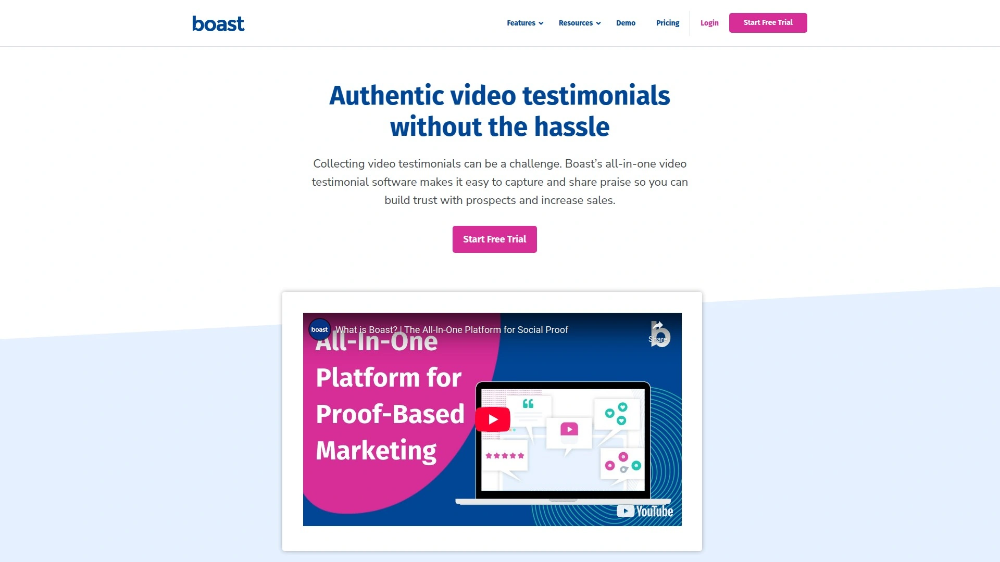

Boast是市场上功能最全面的视频评价平台之一,提供从收集到发布的完整工具链。它不仅能收集视频评价,还能拿到在线评论和客户反馈。

平台支持自动化请求,你可以设置触发条件,在客户完成购买、订阅周期到期等关键时刻自动发送评价邀请。视频编辑器功能比较强,不用导出到第三方软件就能做基础剪辑。

Boast比较适合有专门营销团队的成长型企业或代理商,定价也相对较高,但提供的品牌控制力和展示灵活度值这个价。缺点是缺少一些高级的品牌定制和深度编辑选项,对于追求极致定制的企业可能不够。

***

## **[Trustmary](https://trustmary.com)**

整合评论网站数据的强大平台,自动化程度高,但价格是最贵的之一。

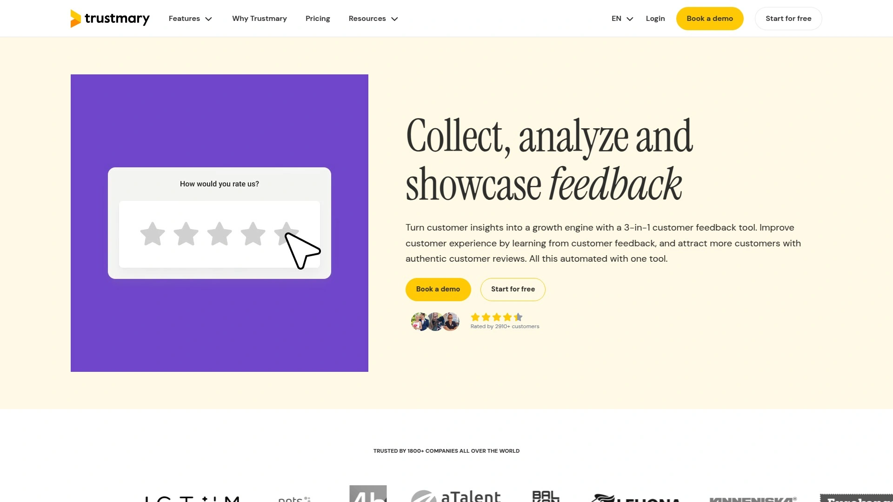

Trustmary的核心优势是能无缝整合各大评论网站的数据,把Google、G2、Yelp、TripAdvisor等平台的评价统一管理和展示。这对于在多个平台都有客户评价的企业来说很实用,避免了到处复制粘贴的麻烦。

平台自带的自动化流程很完善,能根据客户行为自动发送评价请求,还能预设邮件活动排期。内置的Video Studio视频编辑器可以快速润色评价视频。

用户普遍反馈Trustmary上手容易,零学习曲线,从请求评价到编辑、导入、发布的流程很顺畅。但如果你主要需求是从零开始制作自己的视频评价,Trustmary可能不是最佳选择,因为它的定位更偏向整合已有评价,而且价格在同类产品里算最高的。

***

## **[VideoPeel](https://videopeel.com)**

专注视频评价的简单直接的工具,预算友好。

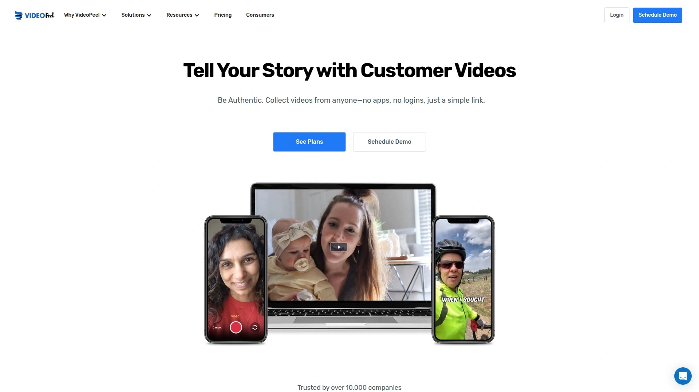

VideoPeel定位很明确,就是帮你收集视频评价。界面简洁,功能聚焦,没有太多花哨的附加功能,适合只需要视频评价收集能力、不需要导入其他平台数据的企业。

价格相对亲民,如果你的预算有限且只关注视频内容,VideoPeel是个务实的选择。但要注意的是它不支持导入已有评价,也不能像Famewall那样在单独页面分享评价或用多种小部件展示。

---

## **[VideoAsk](https://videoask.com)**

互动式视频对话平台,让客户轻松分享体验,建立信任。

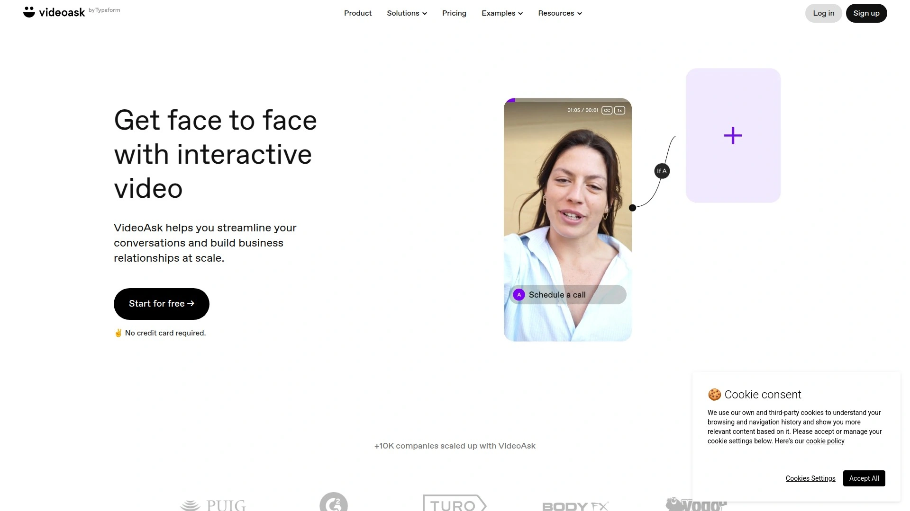

VideoAsk的特色是"对话式"体验,你提出问题,客户用视频或文字回答,整个过程感觉像在聊天而不是填表。这种形式特别适合收集深度的客户故事或产品使用反馈。

平台设计得很友好,降低了客户录制视频的心理门槛。收集到的内容可以直接用在销售和营销材料里,帮助潜在客户建立信任。VideoAsk也可以和Bonjoro结合使用,打造自动化的客户反馈收集流程。

***

## **[Bonjoro](https://bonjoro.com)**

个性化视频消息工具,也支持收集和发布客户评价。

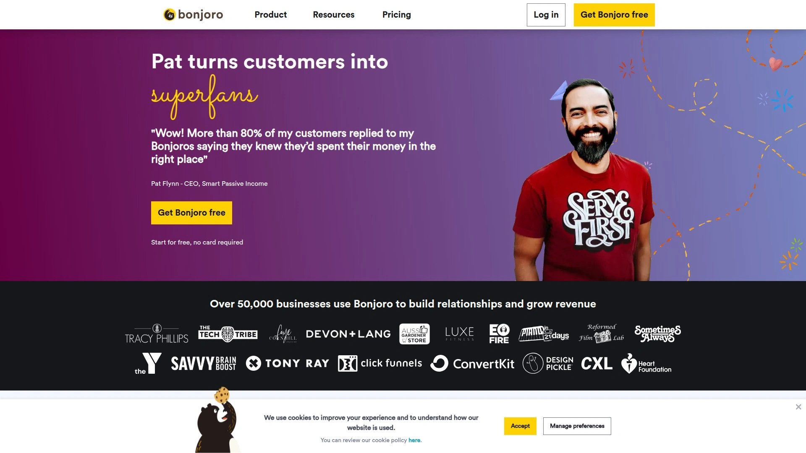

Bonjoro最初是做个性化视频消息的,后来加了评价收集功能。你可以用它收集强有力的视频和文字评价,然后轻松发布到网站和社交媒体渠道。

它的评价收集流程分三步:加载评价问卷,客户完成问卷,上传额外信息并确认授权。整个体验比较顺畅,特别适合已经在用Bonjoro做客户沟通的团队。

有研究显示,使用视频评价的企业转化率能提升80%。Bonjoro帮你把收集、管理、发布这套流程简化了。

***

## **[RaveCapture](https://ravecapture.com)**

电商专用评价软件,帮助把客户反馈转化为强大营销素材。

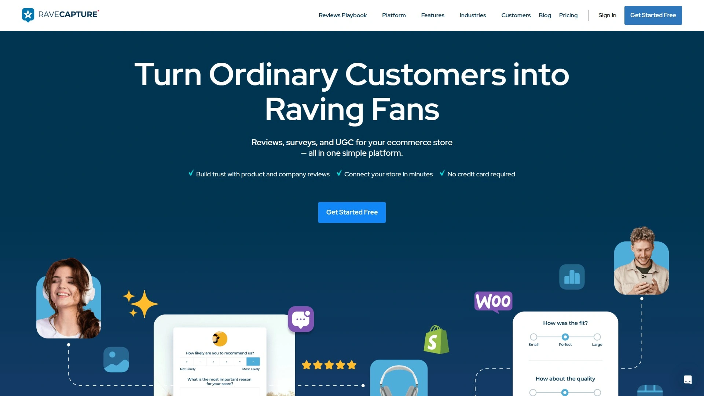

RaveCapture专门为电商和DTC品牌设计,特别擅长从客户反馈中挖掘可用的营销素材。平台能帮你收集、整理和筛选潜在的视频评价素材。

**核心功能:**
- 把文字评论转化成视频脚本建议
- 识别最适合做视频评价的客户
- 管理评价从收集到发布的全流程

对于想要系统化利用客户好评提升转化率和增长的电商企业来说,RaveCapture提供了从反馈到内容的完整路径。

***

## **[Vocal Video](https://vocalvideo.com)**

自动化视频编辑的评价收集工具,省去后期剪辑麻烦。

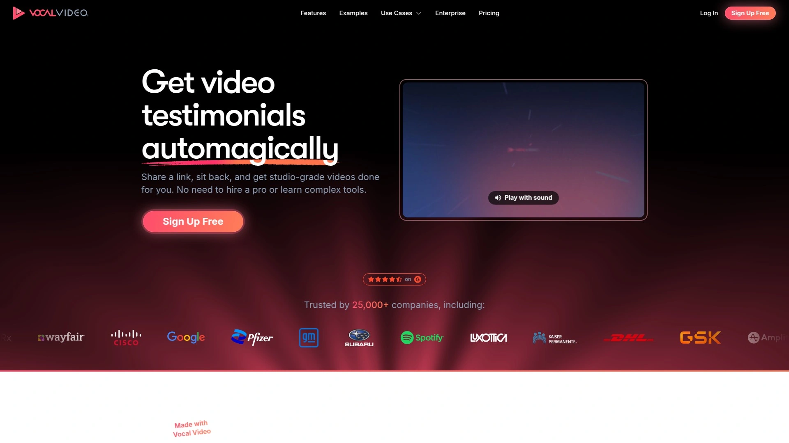

Vocal Video的卖点是"自动编辑",你不需要手动剪视频,系统会自动把客户录制的内容处理成可用的评价视频。每个方案都包含自动编辑功能和全套编辑工具。

平台支持自动收集视频,还提供多种展示选项。如果你需要大量视频评价但又没有视频编辑团队,Vocal Video能节省大量时间。

***

## **[ShoutOut](https://shoutout.social)**

自动化品牌视频制作平台,三步生成完整品牌视频评价。

ShoutOut的核心理念是"简化",只需要三步就能从创建模板到收集内容再到生成品牌视频。界面友好,所有视频都自动带上品牌元素,保持一致的专业感。

**独特功能:**
- 品牌合规视频自动生成
- AI驱动的情感分析
- 社交媒体文案自动撰写

ShoutOut的应用场景很广,能把评价视频用在各种营销渠道,从品牌认知到转化都能覆盖。对于需要快速产出大量品牌视频内容的营销团队,ShoutOut能大幅提高效率。

***

## **[TrustPulse](https://trustpulse.com)**

实时社交证明通知工具,显示网站访客行为,提升15%转化率。

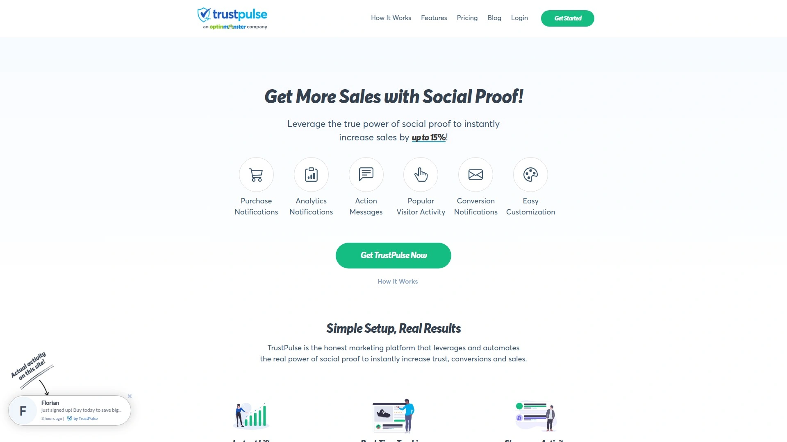

TrustPulse不是传统的评价收集工具,而是一个社交证明通知系统。它能在网站上实时显示其他访客的行为,比如"刚刚有人购买了产品""过去24小时有50人注册"。

**核心功能:**
- 追踪网站实时事件(购买、注册等)
- 显示特定时段内的行动人数
- 智能展示:对的人、对的时间、对的信息
- 自定义通知设计匹配品牌风格
- 无缝对接WordPress、Shopify、WooCommerce等平台

设置只需3分钟,能把转化率提升15%。价格很实惠,基础版每月5美元起(年付),支持2个网站和2500个独立访客。适合小网站、博客主以及想要快速增加可信度的电商店铺。

***

## **[WiserNotify](https://wisernotify.com)**

第一名社交证明工具,内置A/B测试和50+通知模板。

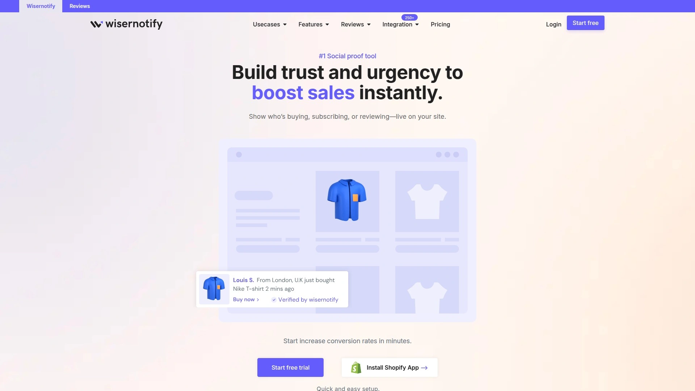

WiserNotify是一个功能强大的社交证明营销工具,帮你通过实时通知提升网站转化率。

**核心优势:**
- 50+现成设计模板,覆盖电商、SaaS、旅游等多个行业
- 内置A/B测试,可以测试不同文案、CTA、图片和设置找到最佳效果
- 智能定向,用高级技术精准触达目标受众
- 自动表单捕获,能自动抓取网站和第三方工具的任何表单提交事件

价格方面,提供7天免费试用和14天退款保证,付费方案每月16美元起。客户支持口碑很好,比起EmbedSocial等竞品更便宜且更智能。

***

## **[Proof](https://proof.com)**

自动化社交证明通知平台,展示实时网站活动。

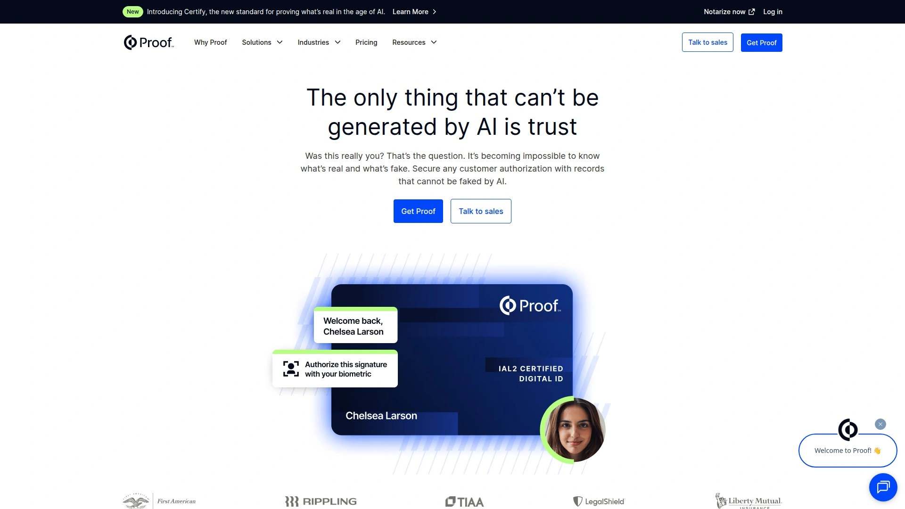

Proof专注于通过实时活动通知来建立信任和营造紧迫感。能追踪和显示购买、注册、下载等网站行为。

平台特别擅长创造FOMO(害怕错过)效应,比如显示"热门产品"或"限时活动"。界面设计简洁,设置流程快速,适合想要立即看到效果的企业。

---

## **[ProveSource](https://provesource.com)**

社交证明小部件平台,多种通知类型增强网站可信度。

ProveSource提供多种社交证明小部件,包括最近活动通知、实时访客计数、客户评价展示等。平台强调易用性,非技术人员也能快速上手。

定价合理,功能全面,适合中小企业和独立创业者。和TrustPulse、WiserNotify类似,但在某些细分功能上有自己的特色。

***

## **[Fomo](https://fomo.com)**

FOMO营销工具,通过社交证明驱动购买决策。

Fomo的名字直接说明了产品定位——制造"害怕错过"的感觉来促成转化。它会在网站上显示最近的购买、注册、评论等活动,让访客觉得"大家都在行动,我也该试试"。

**适用场景:**
- 电商网站增加购买紧迫感
- SaaS产品显示注册热度
- 活动页面展示报名人数

功能和TrustPulse、WiserNotify类似,但品牌调性更年轻,界面设计更现代。

***

## **[EmbedSocial](https://embedsocial.com)**

UGC平台巨头,整合社交媒体和评论内容,50+小部件模板。

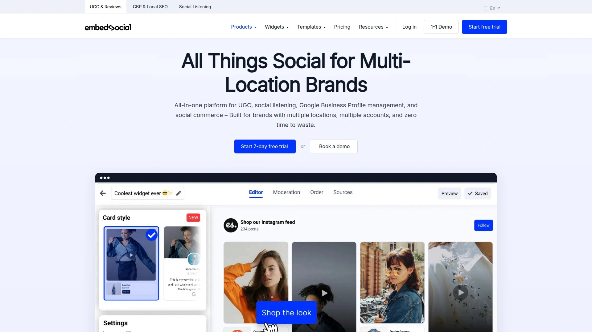

EmbedSocial是一个全方位的用户生成内容平台,帮企业利用社交证明提升在线影响力和可信度。

**核心能力:**
- 连接并拉取Google、Facebook、Instagram、TikTok、Yelp、Airbnb等主流平台的评价
- 通过CSV文件导入评价,创建自定义评论来源
- 50+种小部件模板,展示评价的方式特别多样
- AI驱动的评价回复、内容翻译、评价摘要功能
- 支持通过短信和邮件请求评价,模板可重复使用

**对比竞品的优势:**
相比Loox的34.99美元/月,EmbedSocial的29欧元/月方案功能更丰富,包括无限小部件、自动同步、自定义CSS、分析功能等。相比Yotpo的119美元/月,EmbedSocial的49美元PRO Plus方案提供更多更好的功能。

适合需要在网站上大量展示社交媒体内容和多平台评价的企业。

***

## **[Yotpo](https://yotpo.com)**

企业级评价和UGC平台,涵盖评论、忠诚度、短信营销全生态。

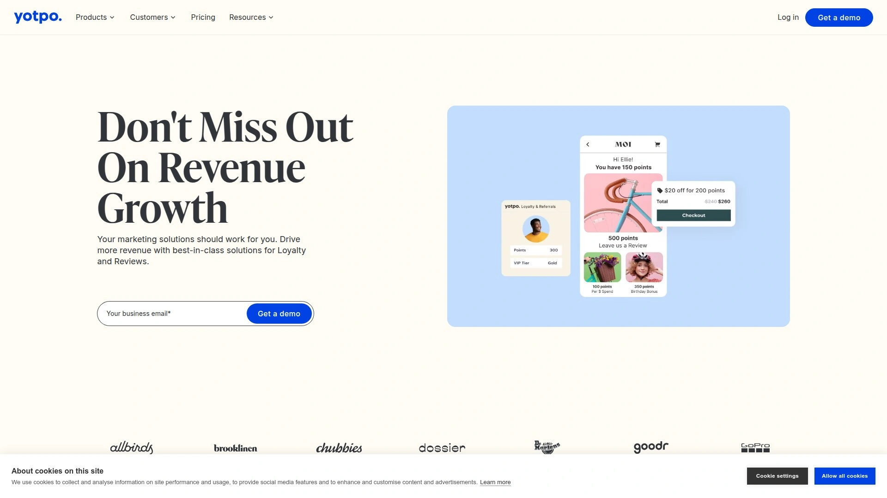

Yotpo是大型电商品牌的首选,功能覆盖从评论收集到忠诚度计划、短信营销的整个生态。已经服务超过9000个品牌,帮他们有效利用评价驱动增长。

**核心功能:**
- 收集更高质量的客户内容(照片和视频评论)
- 在网站和Google上更有效地展示评价
- 最大化评价的营销价值

缺点是价格比较贵,更适合有预算的成长型和成熟型电商企业,不太适合刚起步的小店。如果你的年营收还没到六位数,可能先考虑Loox、Famewall这些更经济的替代品。

***

## **[Loox](https://loox.app)**

Shopify店铺专用评价应用,照片和视频评论收集利器。

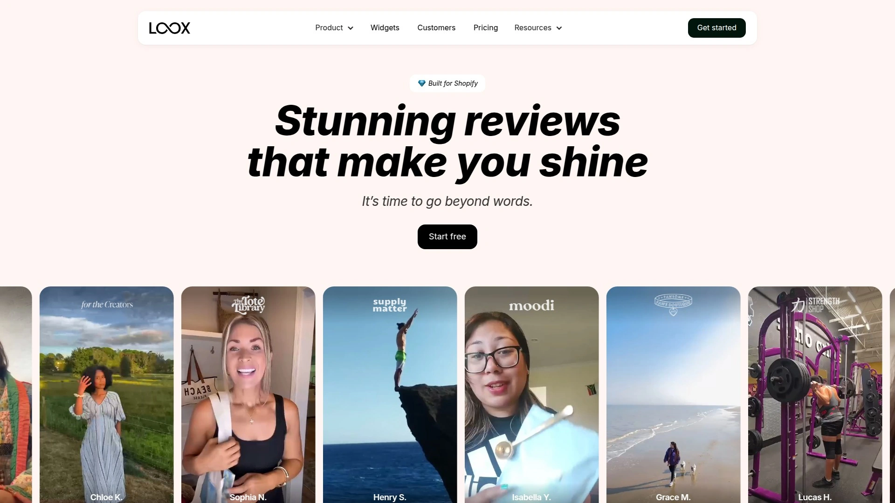

Loox专为Shopify设计,帮店主收集带照片和视频的客户评论,然后分享到社交媒体平台。

**主要特点:**
- 深度整合Shopify生态
- 重点收集视觉化评论(照片/视频)
- 一键分享到Instagram、Facebook等平台
- 爱墙和小部件展示

定价从每月34.99美元起(Scale方案)。如果你是Shopify商家且想要简单直接的评论收集工具,Loox很合适。但如果需要更多定制选项、更低价格或更多导入源,可以看看EmbedSocial、Judge.me、Fera.ai等替代品。

***

## **[Trustpilot](https://trustpilot.com)**

全球知名评论平台,SEO友好,适合建立公开品牌声誉。

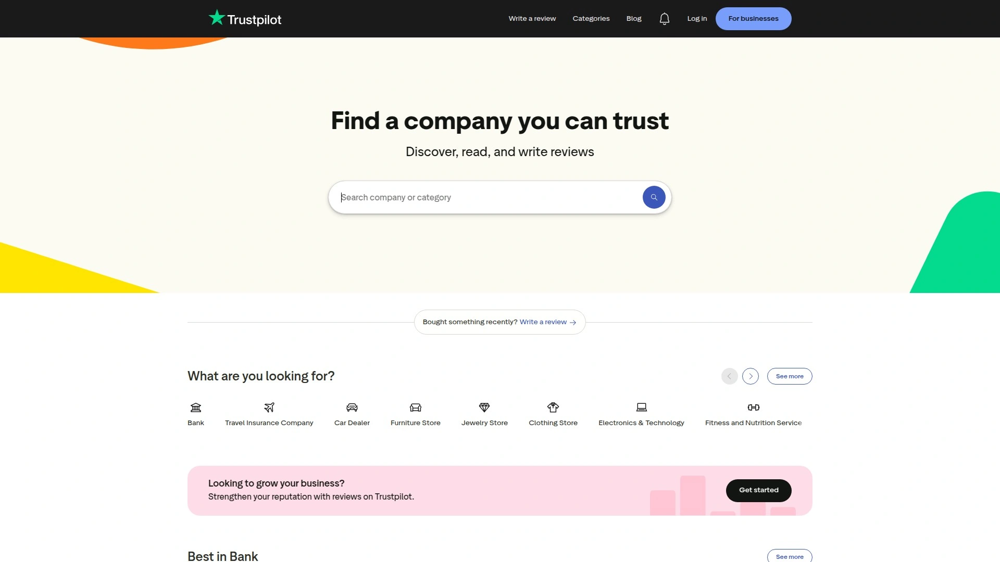

Trustpilot是公开评论平台的老大哥,数百万消费者在上面分享购物体验。

**优势:**
- 强大的SEO效果,评论页面容易被Google收录
- 品牌独立的评论页面,可以在营销素材里引用
- 支持多语言和全球化业务

**劣势:**
- 评论完全公开,包括负面评论
- 无法像专用评价工具那样灵活定制展示样式
- 更适合B2C企业,B2B效果一般

如果你想建立长期的公开品牌信誉,Trustpilot值得投入;如果只想在自己网站上展示精选好评,前面那些工具更合适。

***

## **[Capterra](https://capterra.com)**

软件评论平台,B2B软件采购的重要参考。

Capterra是软件行业的主流评论网站,买家在选购软件前经常会来这里看评价。如果你做的是B2B软件或SaaS产品,在Capterra上积累评价很重要。

**特点:**
- 专注软件和技术产品
- 详细的产品功能对比
- 买家导向的评论结构

Capterra会邀请用户写评价并给予奖励,所以平台上的评论数量增长比较快。不过要注意评价发布有审核机制,不够详细或不符合标准的评价可能不会通过。

设置和使用都比较简单,支持多产品管理。

***

## **[G2](https://g2.com)**

B2B软件评论权威平台,详细的功能评分和对比,影响企业采购决策。

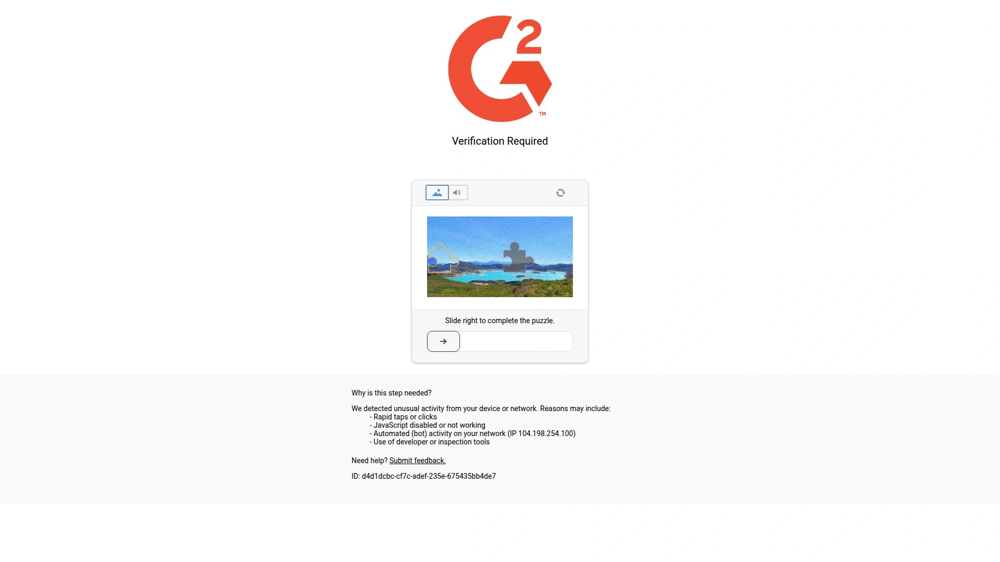

G2是B2B软件领域最权威的评论平台,特别重视详细的功能评分和横向对比。企业采购软件时经常把G2评分作为重要参考。

**核心价值:**
- 真实用户评论,不是营销宣传
- 详细的功能评分矩阵
- 竞品对比报告
- 季度和年度行业报告

对于B2B SaaS公司来说,G2上的评分和排名直接影响销售线索质量。平台也会邀请评价并提供奖励,不过有些用户反馈奖励发放流程不够透明。

G2评论的权重很大,甚至会影响ChatGPT等AI工具的推荐结果。如果你的目标客户是企业,G2是必须重视的平台。

***

## 常见问题

### 视频评价真的比文字评价效果好吗?

效果明显更好。研究显示使用视频评价的企业转化率能提升80%。视频有真人出镜、真实语气、肢体语言,比文字可信度高得多。而且视频更容易在社交媒体传播,一条好的客户见证视频能当广告用。不过要注意的是,收集视频评价的难度也更大,客户需要克服镜头恐惧,所以工具的易用性很重要——像Famewall、StoryPrompt这种能让你录欢迎视频、提供重录功能的平台,提交率会高很多。

### 我已经在多个平台有评价了,怎么统一管理?

选择支持多平台导入的工具,比如Senja支持26个外部源且11个能自动同步,Famewall能导入25+平台,EmbedSocial连接Google、Facebook、Instagram、TikTok、Yelp等主流平台。这些工具能把你在Twitter、LinkedIn、Google、G2、Capterra、App Store等各处的评价全部汇总到一个仪表板,然后统一生成爱墙或小部件嵌入网站。这样避免了到处复制粘贴,而且评价有更新时会自动同步,省心很多。

### 不会写代码能不能用这些工具?

完全没问题。榜单里几乎所有工具都强调"无需编码",像Testimonial、Senja、Famewall都是复制三行HTML代码粘贴到网站就行,支持WordPress、Webflow、Shopify等所有主流平台。有些甚至连代码都不用,直接拖拽配置就能生成展示效果。真正需要技术门槛的反而是那些大型企业级解决方案,但如果你用的是标准建站工具,小白也能在10分钟内搞定评价墙的部署。

***

## 总结

客户评价是最强的营销武器,关键是怎么低成本、高效率地收集和展示。这22个工具各有侧重,视频评价推荐Famewall和StoryPrompt,多平台整合选Senja或EmbedSocial,实时社交证明通知用TrustPulse或WiserNotify,B2B软件必做G2和Capterra。如果你需要一个简单高效、从收集到展示全流程覆盖的平台,[Testimonial](https://testimonial.to)特别适合不想折腾技术、希望快速上线评价墙的创业者和小团队——2分钟完成设置,支持文字和视频,自带26+平台导入,三行代码嵌入任何网站,免费方案就能开始用。
